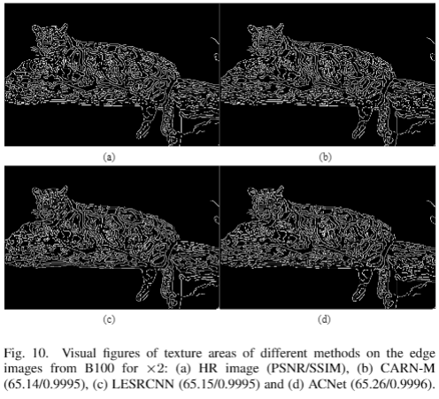
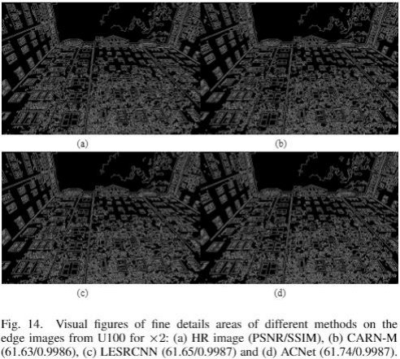

# ACNet
## Asymmetric CNN for image super-resolution
## This paper is conducted by Chunwei Tian, Yong Xu, Wangmeng Zuo, Chia-Wen Lin and David Zhang. It is implemented by Pytorch. 
## Besides, it is accepted by the IEEE Transactions on Systmes, Man, and  Cybernetics: Systems (IEEE TSMC, IF:9.309) in 2021. (Acceptance rate of 10%)
## This paper can be obtained at https://arxiv.org/abs/2103.13634. Also, it is been pushed by the famous CV wechat accout, 52CV at https://mp.weixin.qq.com/s/tpG663ZfUTTAe_Wm4YmcPQ, Cver at https://mp.weixin.qq.com/s/FNpurdPInb_trvgDNYpjwQ, AI technique at  https://mp.weixin.qq.com/s/wBMaU1QCkwL2-3EHETryvw and HappyAIWalker at https://mp.weixin.qq.com/s/zzS16Zxc4WXbXtnH70uBnQ.

### We propose a asymmetric super-resolution network for blind image super-solution. 

### Contributions: 1. An asymmtric architecture is used to enhance the effect of local key features on square kernel in horizontal and vertical ways for extracting more accurate low-frequency features and accelerating training speed in SISR. 
### 2. Using a model can better deal with image super-resolution of certain scale, blind super-resolution and blind super-resolution with blind noise. 

## Abstract
### Deep convolutional neural networks (CNNs) have been widely applied for low-level vision over the past five years. According to nature of different applications, designing appropriate CNN architectures is developed. However, customized architectures gather different features via treating all pixel points as equal to improve the performance of given application, which ignores the effects of local power pixel points and results in low training efficiency. In this paper, we propose an asymmetric CNN (ACNet) comprising an asymmetric block (AB), a memory enhancement block (MEB) and a high-frequency feature enhancement block (HFFEB) for image super-resolution. The AB utilizes one-dimensional asymmetric convolutions to intensify the square convolution kernels in horizontal and vertical directions for promoting the influences of local salient features for SISR. The MEB fuses all hierarchical low-frequency features from the AB via residual learning (RL) technique to resolve the long-term dependency problem and transforms obtained low-frequency features into high-frequency features. The HFFEB exploits low- and high-frequency features to obtain more robust super-resolution features and address excessive feature enhancement problem. Additionally, it also takes charge of reconstructing a high-resolution (HR) image. Extensive experiments show that our ACNet can effectively address single image super-resolution (SISR), blind SISR and blind SISR of blind noise problems. The code of the ACNet is shown at https://github.com/hellloxiaotian/ACNet.

## Requirements (Pytorch)  
#### Pytorch 0.41
#### Python 2.7
#### torchvision 
#### openCv for Python
#### HDF5 for Python
#### Numpy, Scipy
#### Pillow, Scikit-image
#### importlib

## Commands
### Training datasets 
#### The  training dataset is downloaded at https://pan.baidu.com/s/1uqdUsVjnwM_6chh3n46CqQ （secret code：auh1）(baiduyun) or https://drive.google.com/file/d/1TNZeV0pkdPlYOJP1TdWvu5uEroH-EmP8/view (google drive)

### Test datasets 
#### The  test dataset of Set5 is downloaded at 链接：https://pan.baidu.com/s/1YqoDHEb-03f-AhPIpEHDPQ (secret code：atwu) (baiduyun) or https://drive.google.com/file/d/1hlwSX0KSbj-V841eESlttoe9Ew7r-Iih/view?usp=sharing (google drive) 
#### The  test dataset of Set14 is downloaded at 链接：https://pan.baidu.com/s/1GnGD9elL0pxakS6XJmj4tA (secret code：vsks) (baiduyun) or https://drive.google.com/file/d/1us_0sLBFxFZe92wzIN-r79QZ9LINrxPf/view?usp=sharing (google drive) 
#### The  test dataset of B100 is downloaded at 链接：https://pan.baidu.com/s/1GV99jmj2wrEEAQFHSi8jWw （secret code：fhs2) (baiduyun) or https://drive.google.com/file/d/1G8FCPxPEVzaBcZ6B-w-7Mk8re2WwUZKl/view?usp=sharing (google drive) 
#### The  test dataset of Urban100 is downloaded at 链接：https://pan.baidu.com/s/15k55SkO6H6A7zHofgHk9fw (secret code：2hny) (baiduyun) or https://drive.google.com/file/d/1yArL2Wh79Hy2i7_YZ8y5mcdAkFTK5HOU/view?usp=sharing (google drive) 

### preprocessing
### cd dataset
### python div2h5.py

### The codes will be released next week. 

### 1. Network architecture of ACNet

### 2. Implementations of the sub-pixel convolution.

### Test Results
### 3. Average PSNR/SSIM values of different methods for three scale factors of x2, x3 and 4 on the Set5.

### 4. Average PSNR/SSIM values of different methods for three scale factors of x2, x3 and 4 on the Set14.

### 5. Average PSNR/SSIM values of different methods for three scale factors of x2, x3 and 4 on the B100.

### 6. Average PSNR/SSIM values of different methods for three scale factors of x2, x3 and 4 on the U100.

### 7. Complexity of five methods in SISR.

### 8. Running time (Seconds) of five methods on the given LR images of sizes 128x128, 256x256 and 512x512 for scale factor of x2.

### 9. Average FSIM values of different methods with three scale factors of x2, x3 and x4 on the B100.

### 10. Average PSNR/SSIM values of different methods for noise level of 15 with three scale factors of x2, x3 and x4 on the Set5, Set14, B100 and U100. 

#### 11.  Average PSNR/SSIM values of different methods for noise level of 25 with three scale factors of x2, x3 and x4 on the Set5, Set14, B100 and U100. 

#### 12. Average PSNR/SSIM values of different methods for noise level of 35 with three scale factors of x2, x3 and x4 on the Set5, Set14, B100 and U100. 

#### 13. Average PSNR/SSIM values of different methods for noise level of 50 with three scale factors of x2, x3 and x4 on the Set5, Set14, B100 and U100. 

### Visual effect of the ACNet
#### 14. Visual figures of flat areas of different methods from U100 for x2.

#### 15. Visual figures of flat areas of different methods on the Y channels from U100 for x2.

#### 16. Visual figures of flat areas of different methods on the error images from U100 for x2.

#### 17. Visual figures of flat areas of different methods on the edge images from U100 for x2.

#### 18. Visual figures of texture areas of different methods  on the figures from B100 for x2.

#### 19. Visual figures of texture areas of different methods on the channels from B100 for x2.

#### 20. Visual figures of texture areas of different methods on the error images from B100 for x2. 

#### 21. Visual figures of texure areas of different methods on the edge images from B100 for x2. 

#### 22. Visual figures of fine details areas of different methods on the figures from U100 for x2. 

#### 23. Visual figures of fine details areas from different methods on the Y channels from U100 for x2. 

#### 24. Visual figures of fine details areas of different methods on the error images from U100 for x2. 

#### 25. Visual figures of fine details areas of different methods on the edge images from U100 for x2. 

### If you cite this paper, please refer to the following formats: 
#### 1.Tian C, Xu Y, Zuo W, et al. Asymmetric CNN for Image Superresolution[J]. IEEE Transactions on Systems, Man, and Cybernetics: Systems, 2021.

#### @article{tian2021asymmetric,
#### title={Asymmetric CNN for Image Superresolution},
#### author={Tian, Chunwei and Xu, Yong and Zuo, Wangmeng and Lin, Chia-Wen and Zhang, David},
#### journal={IEEE Transactions on Systems, Man, and Cybernetics: Systems},
#### year={2021},
#### publisher={IEEE}
#### }
